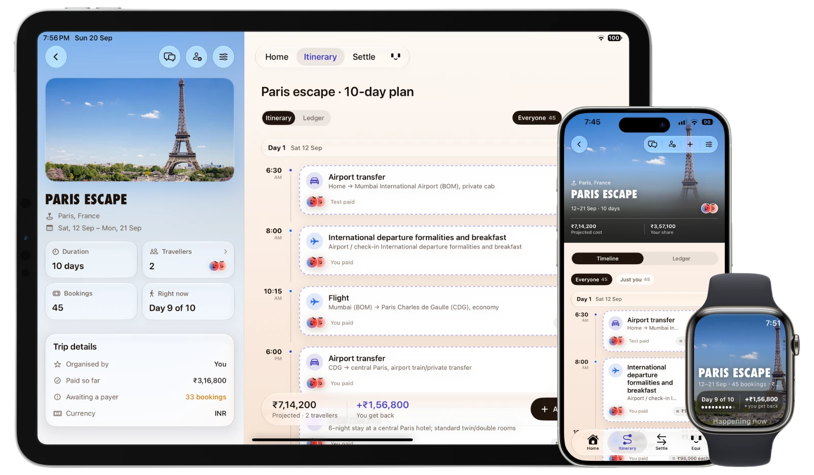

<div align="center">


# Equitrip

Group travel, planned and paid for together.


<br>



</div>

<br>

> One shared record of a trip: the plan everyone is following, and the money
> everyone has spent on it.

Bookings arrive as a PDF and become a timeline. Receipts and payment emails are
read on the device that holds them. At the end, balances collapse into the fewest
transfers that clear them.

SwiftUI for iPhone and iPad, with widgets, a watchOS app, and Supabase behind it.

## What it does

- **Import a trip.** A booking PDF becomes a day-by-day timeline, priced and
  attributed. A consistency pass flags what doesn't add up — a check-in before the
  flight lands.
- **Split anything.** Every booking carries who was on it, who paid, and how it
  divides. Equally, by share, by amount, or excluding the people who weren't there.
- **Read, don't type.** Receipts are parsed from a photograph and reconciled
  against their total; payment emails become expenses waiting to be filed.
- **Settle.** The fewest transfers, recalculated on every change, confirmed by the
  person being paid.
- **Ask.** Equi answers what's next, who owes you, where the money went — through
  the app, Siri, Spotlight, widgets or the watch.

> [!NOTE]
> Every model pass runs on device with Apple Intelligence. Nothing is sent
> anywhere to be understood.

## Architecture

```
Equitrip ────────┐
EquitripWidgets  ├── EquitripShared ──> Supabase · Postgres, RLS, Auth, Realtime
EquitripWatch ───┘
```

Postgres is the only source of truth — no sample data, no offline fallback, every
table RLS-gated. State lives in `@Observable` stores owned by `RootTabView`. The
watch is fed snapshots over WatchConnectivity and never talks to Postgres itself.

<details>
<summary><b>Invariants</b> — held in the app, enforced again in RLS</summary>

<br>

| | |
|---|---|
| **No money from a model** | Amounts and times are copied from the source text. The model decides what something is, never what it cost. |
| **Settlements need their recipient** | A settlement leaves `.pending` only by the person being paid. |
| **The audit trail only grows** | No update or delete policy exists. Corrections are new rows. |
| **One set of arithmetic** | Departure previews ask a hypothetical `Trip` the ordinary questions, so preview and outcome cannot drift. |
| **Schema changes are migrations** | Each one a new numbered file in `supabase/migrations/`. |

</details>

## Build

Xcode 26 or later, and an iOS 27 simulator or device.

```bash
./scripts/build.sh                  # app, widgets, watch
```

```bash
./scripts/run.sh "iPhone 18 Pro"    # build, install, launch
```

There is no test target: a change is verified by a clean build, and behaviour by
running the app. Start at [`docs/CODEMAP.md`](docs/CODEMAP.md) — every file with
its size and purpose.
